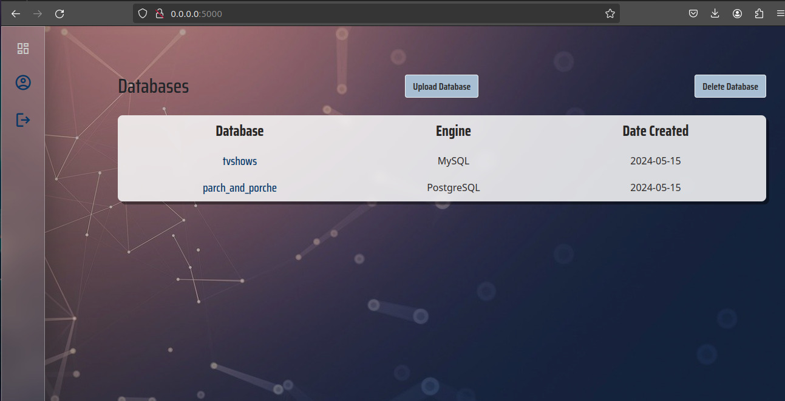

# RSA - A Central Database Hosting Service
<!-- TODO: INCLUDE DESCRIPTION OF PROJECT WITH IMAGES -->

## The Team

- **Stephanie Olulesho** "https://github.com/stephieo"
- **Azeez Okeleji** "https://github.com/Zeezbaba"
- **Adejare Rasheed** "https://github.com/Adejare77"

## Introduction

- **Central Database Management is a Flask application designed to manage users and their associated data in a centralized database system. The application provides a user-friendly interface for adding, deleting, and managing user accounts, as well as uploading and managing database files.**

- **Deployed Site: Central Database Management**
- **Final Project Blog Article:**
- **Author(s) LinkedIn:** (https://www.linkedin.com/in/okeleji-azeez/), (https://www.linkedin.com/in/Olulesho-Stephanie/) (https://www.linkedin.com/in/Adejare-Abdulrasheed/)

## Project Architecture

## Intallation

- **To install and run the Central Database Management application locally, follow these steps:**

-	**Clone the repository to your local machine:**
		git clone https://github.com/Adejare77/Central_database.git
-	**Navigate to the project directory:**
		cd Central_database
-	**Install dependencies using pip:**
		pip install -r requirements.txt

## Usage

- **Getting Started:**
-	**To begin using the Central Database Project Database application, simply download the latest version from our website and follow the installation instructions. Once installed, launch the application and log in with your credentials. You'll be greeted with an intuitive interface, allowing you to navigate through your databases effortlessly**
- **User Guide:**
-	**Viewing Data:**
	**Navigate to the "View" section to explore your database contents.**
	**Use search and filter options to locate specific records quickly.**

- **Adding Data:**
	**Access the "Add" section to input new data entries into your database.**
	**Follow the prompts to enter relevant information and save your changes.**

- **Updating Data:**
	**Select the entry you wish to update from the database view.**
	**Edit the necessary fields and save your modifications to update the record.**

- **Deleting Data:**
	**Locate the entry you want to delete within the database view.**
	**Choose the delete option and confirm to remove the record from your database.**

- **Sorting Data:**
	**Utilize the sorting functionality to organize your database entries based on specific criteria.**
	**Sort by date, name, or any other relevant attribute to streamline data management.**

## Contributing

- **Contributions to Central Database Management are welcome! To contribute:**

-	**Fork the repository.**
-	**Create your feature branch (git checkout -b feature/your-feature).**
-	**Commit your changes (git commit -am 'Add some feature').**
-	**Push to the branch (git push origin feature/your-feature).**
-	**Create a new Pull Request.**

### Backend

- **Framework:** Flask
- **Programming Language:** Python

### Frontend

- **Programming Language:** Javascript
- **Styling:** Bootstrap CSS

### Security

- **Password Hash**

### Database

- **DBMS:** MySQL
- **ORM:** SQLAlchemy

-

### Related projects

-

### Version Control

- **Git/Github**
